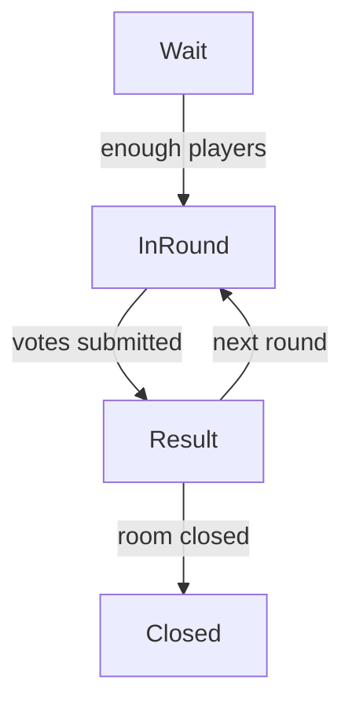

# 📑 EMOGUCHI API 仕様書 v2 (保存なし構成)

> **バージョン:** `v1`  
> **最終更新:** 2025-06-05

本ドキュメントは、保存しないリアルタイム音声ゲーム **EMOGUCHI** の **REST + WebSocket** API 仕様を定義する。コメント反映版として、エンドポイント／イベント／エラー／認証ポリシーを補完した。実装言語は **FastAPI (Python)**、クライアントは **Next.js + Socket.IO** を想定。

---

## 1. アーキテクチャ概要
| レイヤ | プロトコル | 主な責務 |
|--------|-----------|-----------|
| **管理系 API** | REST (`/api/v1/…`) | ルーム生成・破棄、LLM セリフプリフェッチ等 |
| **ゲーム進行** | WebSocket (Socket.IO) | ラウンド開始通知、投票、結果配信 |
| **デバッグ** | REST (`/api/v1/debug/…`) | 開発時のみ。要 `X-Debug-Token` |

### 保存なしのステート管理
- ルーム／プレイヤー情報は **プロセス内メモリ辞書** に保持。
- ロジック層からは `StateStore` 抽象クラス経由でアクセスし、後日 Redis 実装に差し替え可能。

---

## 2. 認証・権限制御
| トークン | 付与タイミング | 送付方法 | 権限 |
|---------|--------------|---------|------|
| **hostToken** | ルーム作成 (`POST /rooms`) 時に応答ヘッダ `X-Host-Token` | REST: `Authorization: Bearer <token>`<br>WS: `auth: { hostToken }` | ルーム設定変更・強制終了 |
| **debugToken** | 環境変数 `DEBUG_API_TOKEN` | REST: `X-Debug-Token` | デバッグ・メトリクス取得|

> ★ ゲストプレイヤーはトークン不要で参加可（playerName だけ送付）。

---

## 3. REST API 定義 (`/api/v1` プレフィックス)
| # | メソッド & パス | 説明 | 認証 | Request `body` | Response `200` | Response Model |
|---|----------------|------|------|----------------|---------------|---------------|
| 1 | **POST** `/rooms` | ルームを新規作成 | なし | `{ mode, voteType, speakerOrder }` | `{ roomId, hostToken }` | `RoomCreated` |
| 2 | **GET** `/rooms/{roomId}` | ルームの現在状態を取得 | 任意 | – | `RoomState` | – |
| 3 | **DELETE** `/rooms/{roomId}` | ルームを強制終了 | hostToken | – | `{ ok: true }` | – |
| 4 | **POST** `/rooms/{roomId}/prefetch` | 次ラウンド用セリフを LLM で先読み | hostToken | `{ batchSize }` | `{ phrases[] }` | `PrefetchResult` |
| – | – | – | – | – | – | – |
| 9 | **GET** `/debug/rooms` | 全ルーム一覧（開発用） | debugToken | – | `{ rooms[] }` | – |

### 3.1 Pydantic Response Models (抜粋)
```python
class RoomCreated(BaseModel):
    roomId: str
    hostToken: str

class RoomState(BaseModel):
    roomId: str
    players: list[str]
    phase: Literal["waiting","in_round","result"]
    config: RoomConfig
```

---

## 4. WebSocket (Socket.IO) イベント定義
| イベント名 | 方向 | Payload 型 | 説明 | ACK |
|------------|------|------------|------|-----|
| `room_created` | S → C | `RoomState` | 参加時の初期ルーム情報 | – |
| `join_room` | C → S | `{ roomId, playerName }` | ルーム参加要求 | ✔︎ |
| `player_joined` | S → C | `{ playerName }` | 新規参加者通知 | – |
| `round_start` | S → C | `{ roundId, phrase }` | ラウンド開始 | – |
| `submit_vote` | C → S | `{ roundId, emotionId }` | リスナー投票 | ✔︎ |
| `round_result` | S → C | `{ roundId, correctEmotion, scores[] }` | 結果発表 | – |
| `error` | S → C | `ErrorPayload` | 共通エラー | – |

### 4.1 ErrorPayload
```jsonc
{
  "code": "EMO-404",
  "message": "Room not found"
}
```
- REST エラーは `HTTP 4xx/5xx` + 同じ JSON ボディ。
- WebSocket は `error` イベントで送出。

---

## 5. CORS / Origin ポリシー
```python
ALLOWED_ORIGINS = [
    "http://localhost:3000",   # dev
    "https://emoguchi.vercel.app"  # prod
]
```

---

## 6. フラッシュ Hook 仕様 (拡張ポイント)
| Hook | 呼び出しタイミング | 引数 | 目的 |
|------|------------------|------|------|
| `on_round_end(state)` | 結果確定直後 | ルーム状態 | 永続化 or 分析集計 |
| `on_room_close(state)` | ルーム破棄直前 | ルーム状態 | 履歴保存 |

デフォルト実装は **No-Op**。`flush_to_db.py` にリポジトリ実装を追加すれば Supabase/PostgreSQL などに書き出せる。

---

## 7. エラーコード一覧
| コード | HTTP | 説明 |
|--------|------|------|
| EMO-400 | 400 | 無効なパラメータ |
| EMO-401 | 401 | 認証トークンが不正 |
| EMO-403 | 403 | 権限不足 (hostToken 必須) |
| EMO-404 | 404 | ルームが存在しない |
| EMO-409 | 409 | 競合状態（例：既にラウンド進行中） |
| EMO-500 | 500 | サーバー内部エラー |

---

## 8. LLM セリフ生成ワークフロー
1. ホストがルーム作成 (`POST /rooms`)  
2. バックエンドは **OpenAI GPT-4o** で *batchSize* 件の台詞をプリフェッチしメモリキャッシュ
3. ラウンド開始時に 1 件ポップし `round_start` で配信
4. キャッシュが閾値以下ならバックグラウンドで再プリフェッチ

> **タイムアウトガード**: GPT API が 3 秒以上応答しない場合はプリフェッチ失敗として `fallback_phrases` を使用し、ゲームテンポを維持。

---

## 9. ステートマシン (Phase Transition)


